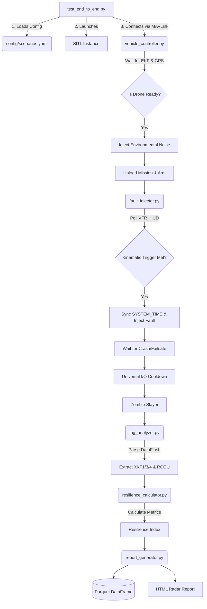

# ArduPilot Resilience Lab: Automated Probing Architecture

## Project Overview
A research-grade, automated diagnostic framework that evaluates the resilience of ArduPilot systems. It transitions away from arbitrary time-based testing into a highly deterministic, mathematically rigorous diagnostic pipeline. The framework launches SITL, injects environmental entropy, flies targeted waypoint missions, triggers spatial faults, and extracts deep EKF telemetry for Machine Learning pipelines.

### End-to-End Execution Flow


## The 5 Architectural Pillars

### 1. Environmental Determinism
- Injects baseline entropy (`SIM_WIND`, `SIM_BARO_NOISE`, `SIM_GPS_NOISE`) directly into the SITL EEPROM via MAVLink (`param_set_send`) before arming.
- Forces the EKF to actively filter realistic environmental noise, preventing the drone from flying in a mathematically "perfect" vacuum.
- Enforces `LOG_DISARMED=1` and `LOG_BITMASK=131071` to guarantee absolute maximum DataFlash telemetry from the millisecond the vehicle boots.

### 2. Kinematic Spatial Fault Triggers
- Abandons blind, rigid `time.sleep()` fault triggers.
- Implements a state-based kinematic envelope trigger (`wait_for_kinematic_trigger`) that actively polls `VFR_HUD` and `NAV_CONTROLLER_OUTPUT`.
- Faults are only injected when specific physical conditions are met (e.g., Altitude > 15m, Groundspeed > 5m/s, Distance to Waypoint < 15m), ensuring exactly reproducible crash geometries regardless of wind conditions.
- Syncs the precise `SYSTEM_TIME` epoch before injecting faults (like GPS Denial) for perfect log alignment.

### 3. Baseline Delta Architecture
- The orchestrator (`test_end_to_end.py`) systematically executes a **Nominal** flight first to establish a mathematical baseline performance envelope.
- It then executes targeted fault scenarios (e.g., `gps_denial_basic`).
- Generates a **Delta Scorecard**, strictly quantifying the fault's deviation against the established nominal baseline (Peak Error, Control Saturation, and the unified Resilience Index).

### 4. Artifact Duality
- Replaces monolithic terminal outputs with dual-purpose data persistence.
- **Machine-Readable**: Exports fully synchronized, post-fault Pandas DataFrames to highly compressed `.parquet` files for seamless downstream Machine Learning integration.
- **Human-Readable**: Generates rich, interactive `.html` reports with Matplotlib time-series and comparative radar charts.

### 5. Universal I/O Cooldown & Zombie Slaying
- Implements a strict `time.sleep(5.0)` buffer following any disarm or flight completion event, ensuring the virtual EEPROM flushes all high-frequency EKF crash telemetry to the DataFlash `.BIN` file (preventing empty logs).
- Executes aggressive OS-level purges (`killall -9 arducopter sim_vehicle.py mavproxy.py`) between test runs to obliterate orphaned C++ physics engines and cleanly release TCP port 5760.

## Core Pipeline Architecture

```text
autopilot-resilience-lab/
├── custom_tools/                  # External analysis helpers
├── setup_ardupilot.sh             # ArduPilot SITL installer script
└── resilience_prober/
    ├── test_end_to_end.py             # Primary Orchestrator (Nominal -> Fault -> Delta)
    ├── config/
    │   └── scenarios.yaml             # Kinematic Triggers & Determinism Parameters
    ├── core/
    │   ├── vehicle_controller.py      # EKF/GPS Readiness Barriers & Mode Control
    │   ├── fault_injector.py          # Spatial Envelope Polling & Epoch Synchronization
    │   ├── log_analyzer.py            # High-Performance DataFlash (XKF1, XKF3, XKF4) Parser
    │   ├── resilience_calculator.py   # Mathematical Resilience Index Computation
    │   └── report_generator.py        # Artifact Duality (Parquet + HTML Exports)
    └── reports/                       # Generated Parquet and HTML Artifacts
```

## The EKF Forensics Engine
The pipeline bypasses standard low-frequency MAVLink telemetry and rips data directly from ArduPilot's internal C++ logging structures (`.BIN` files) using a filtered `recv_match` while-loop to avoid memory exhaustion:
- **XKF1**: Physical drift state (`PN`, `PE`, `PD` in meters)
- **XKF3**: Raw innovations (`IPN`, `IPE` - internal EKF positional drift metrics)
- **XKF4**: Normalized test ratios (Sensor rejection tracking)
- **RCOU**: High-frequency motor output saturation tracking (`C1`-`C4`)

## Quick Start

### Prerequisites
- **ArduPilot SITL built** (arducopter binary in `build/sitl/bin/`)
- **Python 3.10+**

### Setup
```bash
git clone https://github.com/LuciferK47/autopilot-resilience-lab.git
cd autopilot-resilience-lab

# Download ArduPilot source locally (outside git tracking)
chmod +x setup_ardupilot.sh
./setup_ardupilot.sh

# Install Python dependencies
cd resilience_prober
pip install -r requirements.txt

# Ensure PyArrow is installed for the data science engine
python3 -m pip install pyarrow pandas
```

### Execution
```bash
cd resilience_prober

# 1. Clean up any stuck SITL instances
ps aux | grep -E "sim_vehicle\.py|arducopter|mavproxy" | grep -v grep | awk '{print $2}' | xargs -r kill -9

# 2. Run the Architected Pipeline
python test_end_to_end.py
```
