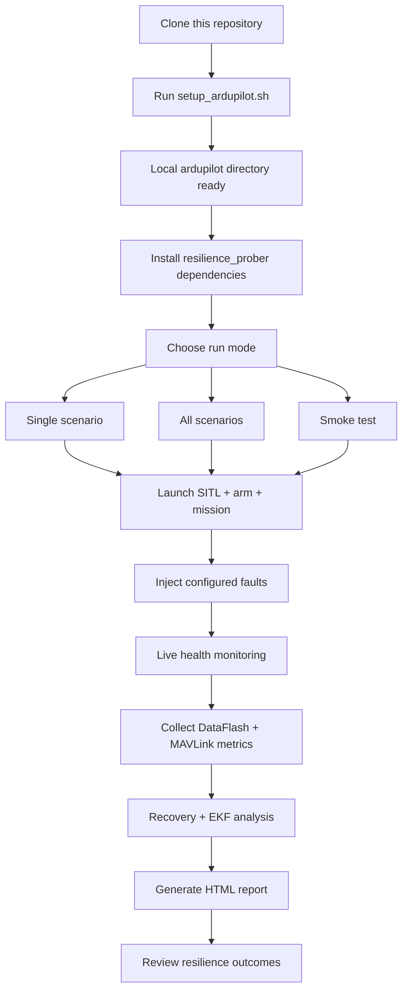
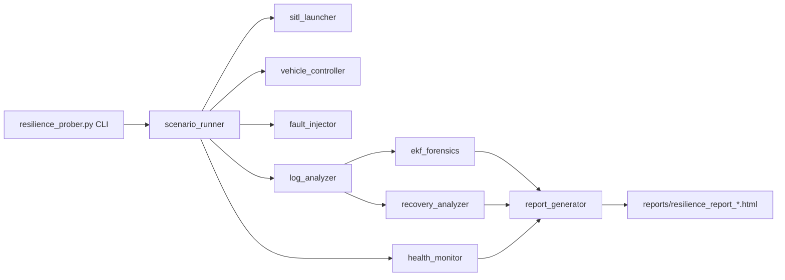

# Ardupilot Resilience Lab

Fault-injection and resilience analysis toolkit for ArduPilot SITL.

This repository helps you run repeatable fault scenarios (GPS loss, motor failure, battery failsafe, wind disturbances, cascading faults, and more), analyze recovery behavior, and generate a rich HTML report with mission metrics and EKF forensics.

## Why This Repository

- Runs realistic mission-based tests in ArduPilot SITL.
- Injects single and multi-stage faults at deterministic times.
- Scores behavior with a quantitative resilience index.
- Produces report artifacts suitable for research and regression tracking.
- Keeps the repository lightweight by not tracking the full ArduPilot source tree.

## Repository Structure

```
autopilot-resilience-lab/
├── setup_ardupilot.sh              # Clones ArduPilot locally (not tracked as submodule)
├── ardupilot/                      # Local clone location (ignored by git)
├── custom_tools/
│   ├── ekf_comparator.py
│   ├── log_reader.py
│   └── sysid_sweeper.py
└── resilience_prober/
    ├── resilience_prober.py        # Main CLI entry point
    ├── config/scenarios.yaml       # Scenario catalog and pass criteria
    ├── core/                       # SITL launch, control, injection, analysis, reporting
    ├── scenarios/                  # Runner and validation
    ├── tests/                      # Unit tests
    └── reports/                    # Generated reports
```

## Prerequisites

- Linux environment (recommended for SITL and automation).
- Git.
- Python 3.10+.
- Build/runtime packages required by ArduPilot SITL.

If this is a fresh machine, install ArduPilot build dependencies first using official ArduPilot docs for your distro.

## Quick Start

1. Clone this repository.

```bash
git clone https://github.com/LuciferK47/autopilot-resilience-lab.git
cd autopilot-resilience-lab
```

2. Download ArduPilot source locally (outside git tracking for this repo).

```bash
chmod +x setup_ardupilot.sh
./setup_ardupilot.sh
```

3. Install Python dependencies for the prober.

```bash
cd resilience_prober
python3 -m pip install -r requirements.txt
python3 -m pip install -r requirements-dev.txt
```

4. Check available scenarios.

```bash
python resilience_prober.py --list
```

5. Run a smoke test.

```bash
python resilience_prober.py --smoke
```

6. Run full campaign.

```bash
python resilience_prober.py --all --clean-logs
```

## Workflow Design

### End-to-End Execution Flow



### Internal Pipeline Design



## Main Commands

From the resilience_prober directory:

```bash
# List all configured scenarios
python resilience_prober.py --list

# Run one scenario
python resilience_prober.py --scenario gps_denial

# Run all scenarios
python resilience_prober.py --all

# Use custom ArduPilot path
python resilience_prober.py --all --ardupilot-path ../ardupilot

# Skip report generation
python resilience_prober.py --scenario nominal --no-report
```

## Development Workflow

```bash
cd resilience_prober

# Lint
make lint

# Tests
make test

# SITL smoke
make smoke
```

CI workflow runs on changes under resilience_prober using:

- .github/workflows/resilience_prober_ci.yml

## Scenarios at a Glance

Scenario definitions are in resilience_prober/config/scenarios.yaml.

Current set includes:

- nominal
- gps_denial
- motor_failure
- battery_failsafe
- wind_shear
- physical_shove
- compass_failure
- cascading_gps_wind
- twist_disturbance

## Outputs and Artifacts

- Generated reports: resilience_prober/reports/
- SITL logs (DataFlash): ardupilot/logs/
- Optional analysis helpers: custom_tools/

## Notes on Repository Size

- The ardupilot directory is intentionally excluded from git tracking.
- Use setup_ardupilot.sh to recreate it on any machine.
- This keeps clone/push operations fast while preserving reproducibility.

## Troubleshooting

- Error: sim_vehicle.py not found
  - Confirm ardupilot was cloned in project root by setup_ardupilot.sh.
  - Or pass --ardupilot-path explicitly.
- SITL fails to launch
  - Verify ArduPilot dependencies are installed and SITL build is complete.
- No report generated
  - Ensure you did not pass --no-report.
  - Check write permissions in resilience_prober/reports.

## License

Add your preferred license file and update this section.
